# NutriCare Agents: Intelligent Vietnamese Nutrition Platform (v0.1.0)

[](https://opensource.org/licenses/MIT)
[](https://github.com/technoob05/NutriCare_Agents)
[](https://gemini.google.com/)
[](https://firebase.google.com/)
[](https://nodejs.org/)
[](https://nextjs.org/)
[](https://www.typescriptlang.org/)
[](https://firebase.google.com/docs/genkit)
[](https://www.langchain.com/)
[](https://langfuse.com/)

**Team:** 404 Brain Not Found

**Live Demo (Deployed on Firebase):**

## ✨ **[https://studio--vietnamese-diet-planner.us-central1.hosted.app/](https://studio--vietnamese-diet-planner.us-central1.hosted.app/)** ✨

---


## Table of Contents

* [Overview](#overview)
* [The Challenge](#the-challenge)
* [Our Solution: NutriCare Agents](#our-solution-nutricare-agents)
  * [Core Features](#core-features)
  * [Responsible AI Implementation](#responsible-ai-implementation)
* [Technology Architecture](#technology-architecture)
  * [Core Technologies](#core-technologies)
  * [System Architecture Diagram](#system-architecture-diagram)
* [Project Structure](#project-structure)
* [Implementation Guide](#implementation-guide)
  * [Requirements](#requirements)
  * [Setup Process](#setup-process)
  * [Environment Configuration](#environment-configuration)
  * [Running the Project](#running-the-project)
  * [Deployment](#deployment)
* [User Experience](#user-experience)
* [Roadmap & Future Development](#roadmap--future-development)
* [Development Team](#development-team)
* [Contributions](#contributions)
* [License](#license)
* [Contact Information](#contact-information)

---

## Overview

**NutriCare Agents (v0.1.0)** is an advanced nutrition advisory system developed for the **GDGOC Hackathon Vietnam 2025**. The platform leverages cutting-edge AI technology including multi-modal Gemini APIs, Graph Neural Networks (GNN), and an orchestrated multi-agent LLM architecture using Genkit and LangChain to deliver personalized nutrition guidance tailored specifically for the Vietnamese population.

Our platform addresses crucial nutrition-related health challenges in Vietnam through a scientifically-grounded, culturally-appropriate approach that considers individual health conditions, taste preferences, regional cuisine variations, and budgetary constraints.

---

## The Challenge

Vietnam faces significant nutrition-related health challenges:

* **Growing Non-Communicable Diseases:** Diet-related conditions account for 74% of deaths in Vietnam, with rising rates of cardiovascular disease, type 2 diabetes, and certain cancers.
* **Digestive Health Issues:** Poor dietary patterns affect approximately 10% of the population, leading to various gastrointestinal disorders.
* **Limited Personalization:** Generic nutritional advice fails to address:
  * Individual health conditions
  * Cultural food preferences
  * Regional cuisine variations
  * Socioeconomic factors
* **Accessibility Barriers:**
  * **Economic:** 78% of the population cannot afford professional nutritional counseling
  * **Temporal:** 65% lack sufficient time for comprehensive meal planning
  * **Physical:** Existing solutions often exclude elderly users and those with disabilities
  * **Financial:** 52% find nutritionally-optimal diets cost-prohibitive

These factors contribute to reduced quality of life, increased healthcare expenditures, and significant health inequities across different population segments.

---

## Our Solution: NutriCare Agents

NutriCare Agents delivers a comprehensive solution through an innovative multi-modal, multi-agent AI platform:

### Core Features

1.  **Personalized Recommendation Engine:** Utilizes Graph Neural Networks trained on extensive Vietnamese nutritional data (2000+ dishes, 500+ ingredients) and user health profiles to generate highly personalized meal recommendations.
2.  **Multi-Agent AI System:** Employs a sophisticated orchestration of specialized AI agents using Gemini, Genkit, and LangChain:
    *   **Search Agent:** Grounds recommendations in verified nutritional science
    *   **RAG Agent:** Retrieves data from internal knowledge bases
    *   **Reasoning Agent:** Applies logical inference to nutritional decisions
    *   **Content Writer:** Crafts clear, culturally-appropriate explanations
    *   **Schedule Agent:** Generates optimized daily/weekly meal plans
    *   **UI/UX Agent:** Ensures accessible information presentation
3.  **Multi-Modal Interaction:** Supports:
    *   Text input/output
    *   Voice commands via Google Speech-to-Text
    *   Image processing for food recognition
    *   Video generation for meal preparation guidance (upcoming)
4.  **Location-Aware Recommendations:** Integrates Google Maps JavaScript API and Places API to locate nearby restaurants and food vendors serving recommended dishes.
5.  **Budget Optimization:** Dynamically adjusts recommendations based on user-defined budget constraints, offering economical substitutions and seasonal adaptations.
6.  **Explainable AI:** Provides transparent rationales for all nutritional recommendations, citing authoritative sources including WHO guidelines and Vietnam National Institute of Nutrition data.
7.  **Live API Console:** Developer interface for testing and exploring all available APIs in real-time.

### Responsible AI Implementation

NutriCare Agents exemplifies responsible AI development:

*   **Equitable Access:** Designed for users across socioeconomic strata and ability levels
*   **Transparency:** Visual representation of decision-making processes with Langfuse monitoring
*   **Scientific Validity:** All recommendations grounded in peer-reviewed nutritional science
*   **User Privacy:** Local data processing with user-controlled data management
*   **Cultural Sensitivity:** Deep integration of Vietnamese culinary traditions and regional variations
*   **Continuous Improvement:** Feedback mechanisms for ongoing refinement

---

## Technology Architecture

### Core Technologies

#### Frontend
*   **Framework:** Next.js (v15.2.3), React
*   **Styling:** Tailwind CSS
*   **State Management:** React Context, TanStack Query
*   **Authentication:** Firebase Authentication
*   **Maps Integration:** Google Maps JavaScript API, Google Places API
*   **Languages:** TypeScript, HTML/CSS

#### Backend & Infrastructure
*   **Serverless Functions:** Firebase Cloud Functions, Next.js API Routes
*   **Database:** Firebase Realtime Database
*   **Storage:** Google Cloud Storage
*   **Analytics:** Google BigQuery, Google Analytics
*   **Deployment:** Firebase Hosting
*   **Live API Console:** Custom built developer interface for API testing

#### AI & Machine Learning
*   **Foundation Models:** Gemini (e.g., Gemini 2.0 Flash, fine-tuned for Vietnamese nutrition)
*   **AI Orchestration:** Genkit for flow management, LangChain for agent construction
*   **Monitoring & Observability:** Langfuse for agent performance tracking
*   **Voice Interfaces:** Google Text-to-Speech API, Google Speech-to-Text API
*   **Multimodal Processing:** Gemini API for image understanding and generation
*   **Search & Grounding:** Gemini API for web search grounding
*   **Recommendation System:** Graph Neural Networks hosted on Vertex AI
*   **Data Processing:** Data mining and model training via Google Colab

### System Architecture Diagram

```mermaid
flowchart TD
    %% === Client Layer ===
    subgraph "CLIENT LAYER"
        direction LR
        WebApp("Next.js Web App\n(Browser)")
        MobileApp("Mobile App\n(iOS/Android)")
    end

    %% === API Gateway & Live API Console ===
    subgraph "API GATEWAY & LIVE API CONSOLE"
        direction TB
        APIGateway("API Gateway\n(Next.js API Routes)")
        LiveAPIConsole("Live API Console\n(Developer Access)")
        
        subgraph "Core API Services"
            direction TB
            ChatAPI("Chat Services API\n/chat-mobi, /multi-agent-chat")
            VoiceAPI("Voice Services API\n/voice-chat, /tts")
            FoodRecommendationAPI("Food Recommendation API\n/emotion-food, /weather-food")
            RecipeAPI("Recipe Services API\n/suggest-recipes, /cooking-instructions")
            NutritionAPI("Nutrition Services API\n/nutrition-info, /meal-understanding")
            MediaAPI("Media Services API\n/image-generation, /meal-recognition")
            LocationAPI("Location Services API\n/nearby-restaurants")
            ExplainerAPI("AI Explainer API\n/ai-explainer, /enhance-prompt")
            NewsAPI("News Services API\n/rss-proxy")
        end
    end

    %% === AI Orchestration Layer ===
    subgraph "AI ORCHESTRATION LAYER"
        direction TB
        
        subgraph "Orchestration Engines"
            direction LR
            Genkit("Genkit\n(AI Flow Orchestration)")
            LangChain("LangChain\n(Agent Construction)")
            Langfuse("Langfuse\n(Monitoring & Observability)")
        end
        
        subgraph "Specialized AI Agents"
            direction TB
            SearchAgent("Search Agent\n(Web Grounding)")
            RAGAgent("RAG Agent\n(Knowledge Retrieval)")
            ReasoningAgent("Reasoning Agent\n(Logical Inference)")
            ContentAgent("Content Writer Agent")
            ScheduleAgent("Meal Schedule Agent")
            PresentationAgent("UI/UX Presentation Agent")
            NutritionAgent("Nutrition Analysis Agent")
            MenuGeneratorAgent("Menu Generator Agent")
            EmotionAgent("Emotion Recognition Agent")
            WeatherAgent("Weather Context Agent")
            ImageGenAgent("Image Generation Agent")
        end
        
        subgraph "AI Flows (Genkit)"
            direction TB
            GenerateMenuFlow("generateMenuFromPreferences.ts")
            SuggestFoodEmotionFlow("suggestFoodByEmotion.ts")
            SuggestFoodWeatherFlow("suggestFoodByWeather.ts")
            ModificationsFlow("suggestMenuModifications.ts")
        end
    end

    %% === Core AI & Cloud Services ===
    subgraph "CORE AI & CLOUD SERVICES"
        direction TB
        subgraph "Google AI Services"
            GeminiModels("Gemini Models\n(Flash, Pro, Multimodal)")
            GNN_Model("GNN Recommendation Model\n(Vertex AI)")
            SpeechServices("Speech Services\n(STT/TTS)")
            VisionAPI("Vision AI API")
        end
        
        subgraph "Data Services"
            FirebaseAuth("Firebase Authentication")
            FirebaseDB("Firebase Realtime DB")
            CloudStorage("Google Cloud Storage")
            BigQuery("Google BigQuery\n(Analytics)")
        end
        
        subgraph "External Services"
            MapsAPI("Google Maps & Places API")
            WeatherAPI("Weather Service API")
            YouTubeAPI("YouTube Data API")
            RSSFeeds("External RSS Feeds")
        end
    end

    %% === Connections ===
    %% Client to API
    WebApp --> APIGateway
    MobileApp --> APIGateway
    WebApp --> LiveAPIConsole
    
    %% API Gateway connections
    APIGateway --> ChatAPI & VoiceAPI & FoodRecommendationAPI & RecipeAPI & NutritionAPI & MediaAPI & LocationAPI & ExplainerAPI & NewsAPI
    LiveAPIConsole --> ChatAPI & VoiceAPI & FoodRecommendationAPI & RecipeAPI & NutritionAPI & MediaAPI & LocationAPI & ExplainerAPI & NewsAPI
    
    %% API to Orchestration
    ChatAPI --> LangChain
    VoiceAPI --> LangChain & SpeechServices
    FoodRecommendationAPI --> SuggestFoodEmotionFlow & SuggestFoodWeatherFlow
    RecipeAPI --> LangChain
    NutritionAPI --> LangChain
    MediaAPI --> LangChain & GeminiModels
    LocationAPI --> MapsAPI
    ExplainerAPI --> LangChain
    NewsAPI --> RSSFeeds
    
    %% Orchestration Layer Connections
    LangChain --> SearchAgent & RAGAgent & ReasoningAgent & ContentAgent & ScheduleAgent & PresentationAgent & NutritionAgent & MenuGeneratorAgent & EmotionAgent & WeatherAgent & ImageGenAgent
    Genkit --> GenerateMenuFlow & SuggestFoodEmotionFlow & SuggestFoodWeatherFlow & ModificationsFlow
    Genkit --> LangChain
    
    %% Monitoring
    LangChain -.-> Langfuse
    Genkit -.-> Langfuse
    
    %% Agents to Models
    SearchAgent & RAGAgent & ReasoningAgent & ContentAgent & ScheduleAgent & PresentationAgent & NutritionAgent & MenuGeneratorAgent & EmotionAgent & ImageGenAgent --> GeminiModels
    MenuGeneratorAgent --> GNN_Model
    WeatherAgent --> WeatherAPI
    EmotionAgent --> VisionAPI
    RAGAgent --> FirebaseDB
    GenerateMenuFlow & SuggestFoodEmotionFlow & SuggestFoodWeatherFlow & ModificationsFlow --> GeminiModels
    GenerateMenuFlow --> GNN_Model
    
    %% API to Services
    APIGateway --> FirebaseAuth & FirebaseDB & CloudStorage
    ChatAPI & VoiceAPI & FoodRecommendationAPI & RecipeAPI & NutritionAPI --> BigQuery
    
    %% Styling
    classDef client fill:#D6EAF8,stroke:#2E86C1,stroke-width:2px,color:#000,font-weight:bold
    classDef api fill:#D1F2EB,stroke:#1ABC9C,stroke-width:2px,color:#000,font-weight:bold
    classDef orchestration fill:#FCF3CF,stroke:#F39C12,stroke-width:2px,color:#000,font-weight:bold
    classDef agent fill:#FDEDEC,stroke:#E74C3C,stroke-width:1px,color:#000
    classDef flow fill:#F5EEF8,stroke:#8E44AD,stroke-width:1px,color:#000
    classDef aimodels fill:#FADBD8,stroke:#CB4335,stroke-width:2px,color:#000,font-weight:bold
    classDef datastore fill:#E8DAEF,stroke:#8E44AD,stroke-width:2px,color:#000,font-weight:bold
    classDef external fill:#D5DBDB,stroke:#2C3E50,stroke-width:2px,color:#000,font-weight:bold
    classDef monitor fill:#F9E79F,stroke:#D4AC0D,stroke-width:3px,color:#000,font-weight:bold
    
    class WebApp,MobileApp client
    class APIGateway,LiveAPIConsole,ChatAPI,VoiceAPI,FoodRecommendationAPI,RecipeAPI,NutritionAPI,MediaAPI,LocationAPI,ExplainerAPI,NewsAPI api
    class Genkit,LangChain orchestration
    class Langfuse monitor
    class SearchAgent,RAGAgent,ReasoningAgent,ContentAgent,ScheduleAgent,PresentationAgent,NutritionAgent,MenuGeneratorAgent,EmotionAgent,WeatherAgent,ImageGenAgent agent
    class GenerateMenuFlow,SuggestFoodEmotionFlow,SuggestFoodWeatherFlow,ModificationsFlow flow
    class GeminiModels,GNN_Model,SpeechServices,VisionAPI aimodels
    class FirebaseAuth,FirebaseDB,CloudStorage,BigQuery datastore
    class MapsAPI,WeatherAPI,YouTubeAPI,RSSFeeds external
```



---

## Project Structure

Here's a high-level overview of the project's directory structure:

```
NutriCare_Agents/
├── docs/                 # Project documentation, blueprints
├── public/               # Static assets (images, data files)
├── src/                  # Main source code
│   ├── ai/               # AI models, orchestration, and flows
│   │   ├── agents/       # LangChain agent definitions
│   │   ├── data/         # Data files for AI (manifests, default menus)
│   │   ├── flows/        # Genkit flow definitions
│   │   ├── monitoring/   # Langfuse integration and monitoring
│   │   ├── utils/        # AI utility functions
│   │   ├── ai-config.ts  # AI configuration and settings
│   │   └── ai-instance.ts # AI model initialization
│   ├── app/              # Next.js App Router
│   │   ├── api/          # API route handlers
│   │   │   ├── chat-mobi/       # Mobile chat API routes
│   │   │   ├── multi-agent-chat/ # Core chat engine routes
│   │   │   ├── voice-chat/      # Voice interface routes
│   │   │   └── ...              # Other API routes
│   │   └── (pages)/      # Page components
│   │       ├── chat/            # Chat interface pages
│   │       ├── profile/         # User profile pages
│   │       ├── recipes/         # Recipe browsing pages
│   │       └── ...              # Other pages
│   ├── components/       # Reusable React components
│   │   ├── chat-mobi/    # Mobile chat interface components
│   │   ├── live-assistant/ # Voice assistant components
│   │   ├── live-api/     # Live API Console components
│   │   └── ui/           # General UI components
│   ├── context/          # React Context providers
│   ├── hooks/            # Custom React hooks
│   ├── lib/              # Utility functions and libs
│   │   ├── api/          # API client utilities
│   │   ├── firebase/     # Firebase configurations
│   │   └── utils/        # General utilities
│   ├── services/         # External service integrations
│   │   ├── maps/         # Google Maps integration
│   │   ├── search/       # Search integrations
│   │   └── weather/      # Weather API integration
│   └── types/            # TypeScript type definitions
├── .env.example          # Example environment variables
├── firebase.json         # Firebase configuration
├── genkit.json           # Genkit configuration
├── next.config.js        # Next.js configuration
├── package.json          # Project dependencies and scripts
├── README.md             # This file
├── tailwind.config.js    # Tailwind CSS configuration
└── tsconfig.json         # TypeScript configuration
```

---

## Implementation Guide

### Requirements

*   **Node.js:** v18.x or later
*   **npm:** (comes with Node.js) or yarn
*   **Google Cloud Account:** With access to Gemini API, Vertex AI, and other Google Cloud services
*   **Firebase Account:** For authentication, database, cloud functions, and hosting services
*   **API Keys & Credentials:**
    *   Gemini API Key (`GEMINI_API_KEY`)
    *   Google Generative AI API Key (`GOOGLE_GENAI_API_KEY`)
    *   Google Maps JavaScript API Key (`GOOGLE_MAPS_API_KEY`)
    *   Google Cloud Service Account JSON (`GOOGLE_APPLICATION_CREDENTIALS`)
    *   Firebase project configuration details

### Setup Process

1. **Clone the repository:**
   ```bash
   git clone https://github.com/technoob05/NutriCare_Agents
   cd NutriCare_Agents
   ```

2. **Install dependencies:**
   ```bash
   npm install
   ```

### Environment Configuration

Create a `.env.local` file in the root of the project by copying `.env.example` and filling in your specific credentials:

```bash
cp .env.example .env.local
```

Then, edit `.env.local` with your actual values:

```plaintext
# Required AI & Google Services Configurations
GOOGLE_GENAI_API_KEY=your_google_genai_api_key_here
GEMINI_API_KEY=your_gemini_api_key_here
GOOGLE_MAPS_API_KEY=your_google_maps_api_key_here

# Google Cloud Service Account
GOOGLE_APPLICATION_CREDENTIALS=your_path_to_google_service_account_json

# Firebase Configuration
NEXT_PUBLIC_FIREBASE_API_KEY=your_firebase_api_key
NEXT_PUBLIC_FIREBASE_AUTH_DOMAIN=your_auth_domain.firebaseapp.com
NEXT_PUBLIC_FIREBASE_PROJECT_ID=your_project_id
NEXT_PUBLIC_FIREBASE_STORAGE_BUCKET=your_storage_bucket.appspot.com
NEXT_PUBLIC_FIREBASE_MESSAGING_SENDER_ID=your_messaging_sender_id
NEXT_PUBLIC_FIREBASE_APP_ID=your_app_id
NEXT_PUBLIC_FIREBASE_MEASUREMENT_ID=your_measurement_id

# Vertex AI Endpoint (for GNN model)
VERTEX_AI_ENDPOINT=your_vertex_ai_endpoint_url

# LangChain & Langfuse Configuration
LANGCHAIN_API_KEY=your_langchain_api_key
LANGFUSE_PUBLIC_KEY=your_langfuse_public_key
LANGFUSE_SECRET_KEY=your_langfuse_secret_key
LANGFUSE_HOST=https://cloud.langfuse.com
```

### Running the Project

The project architecture requires running multiple servers for full functionality:

1. **Start the Next.js development server:**
   ```bash
   npm run dev
   ```
   The application will be available at `http://localhost:9000`.

2. **Start the Genkit development server:**
   ```bash
   npm run genkit:dev
   ```
   Or with auto-restart on file changes:
   ```bash
   npm run genkit:watch
   ```
   The Genkit server typically runs on `http://localhost:3400`.

3. **Start the Live API Console (optional):**
   ```bash
   npm run api:console
   ```
   The Live API Console will be available at `http://localhost:8080`.

### Building for Production

1. **Build the Next.js application:**
   ```bash
   npm run build
   ```

2. **Start the production server:**
   ```bash
   npm run start
   ```

### Deployment

The project is configured for deployment using Firebase:

1. **Login to Firebase:**
   ```bash
   firebase login
   ```

2. **Preview the deployment:**
   ```bash
   firebase hosting:channel:deploy preview
   ```

3. **Deploy to production:**
   ```bash
   firebase deploy
   ```

This will deploy:
- Next.js application via Firebase Hosting
- Firebase Cloud Functions
- Firebase Authentication configuration
- Firebase Realtime Database rules

---

## User Experience

NutriCare Agents provides an intuitive, multi-modal user journey:

1. **Onboarding:**
   - Account creation via Google Authentication or email
   - Comprehensive health profile setup
   - Dietary preferences and restrictions

2. **Interaction Methods:**
   - Conversational text interface
   - Voice commands with natural language processing
   - Image recognition for meal analysis
   - Location-based restaurant recommendations

3. **Personalized Nutrition:**
   - Dynamic meal planning based on health goals
   - Culturally-appropriate Vietnamese cuisine options
   - Adaptive recommendations based on feedback
   - Budget-conscious meal selections

4. **Transparency & Education:**
   - Nutritional content visualization
   - Explainable AI recommendations with sources
   - Educational content about nutritional science
   - Progress tracking toward health goals

5. **Developer Experience:**
   - Live API Console for testing and development
   - Comprehensive API documentation
   - Real-time monitoring with Langfuse
   - Extensible architecture for new features

---

## Roadmap & Future Development

NutriCare Agents has an ambitious development roadmap:

**Near-Term (6 Months):**
* **Advanced Video Generation:** AI-generated recipe videos with step-by-step instructions
* **Enhanced Image Recognition:** Food photo analysis with nutritional content estimation
* **Community Features:** Recipe sharing, meal planning collaboration, and peer support
* **Offline Functionality:** Core features available without internet connection

**Medium-Term (12-18 Months):**
* **Health Device Integration:** Connection with Google Fit, Apple Health, and wearables
* **Extended Medical Support:** Comprehensive coverage for 50+ health conditions
* **Regional Specialization:** Detailed focus on North, Central, and South Vietnamese cuisine
* **Seasonal Adaptation:** Dynamically adjusting recommendations based on ingredient availability

**Long-Term Vision:**
* **Clinical Integration:** Partnerships with healthcare providers for medically-supervised nutrition
* **Research Platform:** Anonymized data collection for nutrition science advancement
* **International Adaptation:** Framework for adaptation to other cultural contexts
* **Predictive Health Modeling:** AI-powered forecasting of health outcomes based on nutritional choices

**Impact Goals:**
* 20% reduction in nutrition-related healthcare costs within 3 years
* 30% improvement in quality of life metrics for users with chronic conditions
* 25% decrease in food waste through optimized meal planning
* Support for sustainable food systems through local ingredient recommendations

---

## Development Team

**404 Brain Not Found Team:**

* **Nguyễn Lâm Phú Quý:** Project Lead / Product Manager / Data Scientist
* **Huỳnh Trung Kiệt:** AI Engineer (Recommendation Systems)
* **Đào Sỹ Duy Minh:** AI Engineer (Multi-Agent Systems)
* **Bàng Mỹ Linh:** AI Engineer (NLP Specialist)
* **Phan Bá Thanh:** Data Engineer / Infrastructure Specialist

---

## Contributions

We welcome contributions from the community. To contribute to NutriCare Agents:

1. Fork the repository
2. Create a feature branch (`git checkout -b feature/amazing-feature`)
3. Commit your changes (`git commit -m 'Add some amazing feature'`)
4. Push to the branch (`git push origin feature/amazing-feature`)
5. Open a Pull Request

Please ensure your code follows our style guidelines and includes appropriate tests.

---

## License

This project is licensed under the MIT License - see the [LICENSE](LICENSE) file for details.

---

## Contact Information

* **Project Lead:** Nguyễn Lâm Phú Quý
* **Email:** [nguyenlamphuquykh@gmail.com](mailto:nguyenlamphuquykh@gmail.com)
* **Phone:** +84 392794728
* **Team Portfolios:** [Team Drive Folder](https://drive.google.com/drive/folders/11mYK9Y27pWBh4bT4Tzd7kN8u9u6O-PU3?usp=sharing)
* **GitHub:** [technoob05](https://github.com/technoob05)
* **Project Repository:** [NutriCare_Agents](https://github.com/technoob05/NutriCare_Agents)