# NutriCare Agents: Intelligent Vietnamese Nutrition Platform

[](https://opensource.org/licenses/MIT)
[](https://github.com/technoob05/NutriCare_Agents)
[](https://gemini.google.com/)
[](https://firebase.google.com/)

**Team:** 404 Brain Not Found

**Live Demo (Deployed on Firebase):**

## ✨ **[https://studio--vietnamese-diet-planner.us-central1.hosted.app/](https://studio--vietnamese-diet-planner.us-central1.hosted.app/)** ✨

---


## Table of Contents

* [Overview](#overview)
* [The Challenge](#the-challenge)
* [Our Solution: NutriCare Agents](#our-solution-nutricare-agents)
  * [Core Features](#core-features)
  * [Responsible AI Implementation](#responsible-ai-implementation)
* [Technology Architecture](#technology-architecture)
  * [Core Technologies](#core-technologies)
  * [System Architecture Diagram](#system-architecture-diagram)
* [Implementation Guide](#implementation-guide)
  * [Requirements](#requirements)
  * [Setup Process](#setup-process)
  * [Environment Configuration](#environment-configuration)
  * [Deployment](#deployment)
* [User Experience](#user-experience)
* [Roadmap & Future Development](#roadmap--future-development)
* [Development Team](#development-team)
* [Contributions](#contributions)
* [License](#license)
* [Contact Information](#contact-information)

---

## Overview

**NutriCare Agents** is an advanced nutrition advisory system developed for the **GDGOC Hackathon Vietnam 2025**. The platform leverages cutting-edge AI technology including multi-modal Gemini APIs, Graph Neural Networks (GNN), and an orchestrated multi-agent LLM architecture to deliver personalized nutrition guidance tailored specifically for the Vietnamese population.

Our platform addresses crucial nutrition-related health challenges in Vietnam through a scientifically-grounded, culturally-appropriate approach that considers individual health conditions, taste preferences, regional cuisine variations, and budgetary constraints.

---

## The Challenge

Vietnam faces significant nutrition-related health challenges:

* **Growing Non-Communicable Diseases:** Diet-related conditions account for 74% of deaths in Vietnam, with rising rates of cardiovascular disease, type 2 diabetes, and certain cancers.

* **Digestive Health Issues:** Poor dietary patterns affect approximately 10% of the population, leading to various gastrointestinal disorders.

* **Limited Personalization:** Generic nutritional advice fails to address:
  * Individual health conditions
  * Cultural food preferences
  * Regional cuisine variations
  * Socioeconomic factors

* **Accessibility Barriers:**
  * **Economic:** 78% of the population cannot afford professional nutritional counseling
  * **Temporal:** 65% lack sufficient time for comprehensive meal planning
  * **Physical:** Existing solutions often exclude elderly users and those with disabilities
  * **Financial:** 52% find nutritionally-optimal diets cost-prohibitive

These factors contribute to reduced quality of life, increased healthcare expenditures, and significant health inequities across different population segments.

---

## Our Solution: NutriCare Agents

NutriCare Agents delivers a comprehensive solution through an innovative multi-modal, multi-agent AI platform:

### Core Features

1. **Personalized Recommendation Engine:** Utilizes Graph Neural Networks trained on extensive Vietnamese nutritional data (2000+ dishes, 500+ ingredients) and user health profiles to generate highly personalized meal recommendations.

2. **Multi-Agent AI System:** Employs a sophisticated orchestration of specialized AI agents using Gemini and LangGraph:
   * **Search Agent:** Grounds recommendations in verified nutritional science
   * **RAG Agent:** Retrieves data from internal knowledge bases
   * **Reasoning Agent:** Applies logical inference to nutritional decisions
   * **Content Writer:** Crafts clear, culturally-appropriate explanations
   * **Schedule Agent:** Generates optimized daily/weekly meal plans
   * **UI/UX Agent:** Ensures accessible information presentation

3. **Multi-Modal Interaction:** Supports:
   * Text input/output
   * Voice commands via Google Speech-to-Text
   * Image processing for food recognition (future)
   * Video generation for meal preparation guidance (upcoming)

4. **Location-Aware Recommendations:** Integrates Google Maps JavaScript API and Places API to locate nearby restaurants and food vendors serving recommended dishes.

5. **Budget Optimization:** Dynamically adjusts recommendations based on user-defined budget constraints, offering economical substitutions and seasonal adaptations.

6. **Explainable AI:** Provides transparent rationales for all nutritional recommendations, citing authoritative sources including WHO guidelines and Vietnam National Institute of Nutrition data.

### Responsible AI Implementation

NutriCare Agents exemplifies responsible AI development:

* **Equitable Access:** Designed for users across socioeconomic strata and ability levels
* **Transparency:** Visual representation of decision-making processes
* **Scientific Validity:** All recommendations grounded in peer-reviewed nutritional science
* **User Privacy:** Local data processing with user-controlled data management
* **Cultural Sensitivity:** Deep integration of Vietnamese culinary traditions and regional variations
* **Continuous Improvement:** Feedback mechanisms for ongoing refinement

---

## Technology Architecture


### Core Technologies

#### Frontend
* **Framework:** Next.js, React
* **Styling:** Tailwind CSS
* **Authentication:** Firebase Authentication
* **Maps Integration:** Google Maps JavaScript API, Google Places API
* **Languages:** TypeScript, HTML/CSS

#### Backend & Infrastructure
* **Serverless Functions:** Firebase Cloud Functions
* **Database:** Firebase Realtime Database
* **Storage:** Google Cloud Storage
* **Analytics:** Google BigQuery, Google Analytics
* **Development Environment:** Firebase Studio (prototype development)
* **Deployment:** Firebase Hosting

#### AI & Machine Learning
* **Foundation Models:** Gemini 2.0 Flash (fine-tuned for Vietnamese nutrition)
* **AI Orchestration:** LangChain, GenKit, Google GenAI SDK
* **Voice Interfaces:** Google Text-to-Speech API, Google Speech-to-Text API
* **Multimodal Processing:** Gemini API for image understanding and generation
* **Search & Grounding:** Gemini API for web search grounding
* **Recommendation System:** FastAPI backend hosted on Vertex AI
* **Data Processing:** Data mining and model training via Google Colab

### System Architecture Diagram

```mermaid
graph TD
    subgraph "User Interface Layer"
        UI[Next.js Web Application]
        Voice[Voice Interface]
        Map[Google Maps Integration]
        Auth[Google Authentication]
    end

    subgraph "API Gateway Layer"
        APIGateway[Firebase Cloud Functions]
    end

    subgraph "AI Orchestration Layer"
        GenKit[GenKit / GenAI SDK]
        LangChain[LangChain Orchestration]
        AgentSystem[Multi-Agent System]
    end

    subgraph "AI Agents"
        SearchAgent[Search Agent]
        RAGAgent[RAG Agent]
        ReasoningAgent[Reasoning Agent]
        ContentAgent[Content Writer]
        ScheduleAgent[Schedule Agent]
        UXAgent[UI/UX Agent]
    end

    subgraph "AI Services"
        Gemini[Gemini API]
        STT[Speech-to-Text]
        TTS[Text-to-Speech]
        ImgGen[Image Generation]
        VideoGen[Video Generation - Future]
    end

    subgraph "Recommendation System"
        VertexAPI[Vertex AI Endpoint]
        FastAPI[FastAPI Service]
        GNN[Graph Neural Network]
    end

    subgraph "External Services"
        GMaps[Google Maps API]
        Places[Google Places API]
        WebSearch[Web Search Grounding]
    end

    subgraph "Data Layer"
        Firebase[Firebase Realtime DB]
        CloudStorage[Google Cloud Storage]
        BigQuery[BigQuery Analytics]
    end

    UI --> APIGateway
    Voice --> STT --> APIGateway
    Auth --> UI
    
    APIGateway --> GenKit
    APIGateway --> LangChain
    APIGateway --> VertexAPI
    APIGateway --> GMaps
    APIGateway --> Places
    
    GenKit --> AgentSystem
    LangChain --> AgentSystem
    
    AgentSystem --> SearchAgent
    AgentSystem --> RAGAgent
    AgentSystem --> ReasoningAgent
    AgentSystem --> ContentAgent
    AgentSystem --> ScheduleAgent
    AgentSystem --> UXAgent
    
    SearchAgent --> WebSearch
    RAGAgent --> Firebase
    
    AgentSystem --> Gemini
    AgentSystem --> ImgGen
    AgentSystem --> VideoGen
    AgentSystem --> TTS
    
    VertexAPI --> FastAPI
    FastAPI --> GNN
    
    APIGateway --> Firebase
    APIGateway --> CloudStorage
    APIGateway --> BigQuery
    
    Map --> UI

    %% Styling
    classDef frontend fill:#f9f,stroke:#333,stroke-width:2px;
    classDef backend fill:#ccf,stroke:#333,stroke-width:2px;
    classDef ai fill:#cfc,stroke:#333,stroke-width:2px;
    classDef data fill:#ffc,stroke:#333,stroke-width:2px;
    classDef external fill:#fcf,stroke:#333,stroke-width:2px;

    class UI,Voice,Auth,Map frontend;
    class APIGateway,Firebase,CloudStorage,BigQuery backend;
    class GenKit,LangChain,AgentSystem,Gemini,STT,TTS,ImgGen,VideoGen ai;
    class SearchAgent,RAGAgent,ReasoningAgent,ContentAgent,ScheduleAgent,UXAgent ai;
    class VertexAPI,FastAPI,GNN ai;
    class GMaps,Places,WebSearch external;
```



---

## Implementation Guide

### Requirements

* **Node.js:** v18.x or later
* **Google Cloud Account:** With access to Gemini API and other Google Cloud services
* **Firebase Account:** For authentication, database, and hosting services
* **API Keys:**
  * Gemini API
  * Google Maps JavaScript API
  * Google Places API
  * Google Speech-to-Text/Text-to-Speech APIs

### Setup Process

1. **Clone the repository:**
   ```bash
   git clone https://github.com/technoob05/NutriCare_Agents
   cd NutriCare_Agents
   ```

2. **Install dependencies:**
   ```bash
   npm install
   ```

### Environment Configuration

Create a `.env.local` file with the following configurations:

```plaintext
# Required Configurations
GOOGLE_GENAI_API_KEY=your_gemini_api_key
GEMINI_API_KEY=your_gemini_api_key
GOOGLE_MAPS_API_KEY=your_maps_api_key

# Firebase Configuration
NEXT_PUBLIC_FIREBASE_API_KEY=your_firebase_api_key
NEXT_PUBLIC_FIREBASE_AUTH_DOMAIN=your_auth_domain
NEXT_PUBLIC_FIREBASE_PROJECT_ID=your_project_id
NEXT_PUBLIC_FIREBASE_STORAGE_BUCKET=your_storage_bucket
NEXT_PUBLIC_FIREBASE_MESSAGING_SENDER_ID=your_messaging_sender_id
NEXT_PUBLIC_FIREBASE_APP_ID=your_app_id
NEXT_PUBLIC_FIREBASE_MEASUREMENT_ID=your_measurement_id

# Google Cloud Services
GOOGLE_APPLICATION_CREDENTIALS=path/to/service-account-key.json
VERTEX_AI_ENDPOINT=your_vertex_ai_endpoint
```

### Deployment

**Development Environment:**
```bash
npm run dev
```

**Production Build:**
```bash
npm run build
npm run start
```

**Firebase Deployment:**
```bash
firebase login
firebase deploy
```

---

## User Experience

The NutriCare Agents platform provides an intuitive, multi-modal user journey:

1. **Onboarding:** Users create accounts via Google Authentication or email
2. **Health Profile:** Users provide health information and dietary preferences
3. **Interaction Methods:**
   * Text-based queries
   * Voice commands
   * Image uploads (future feature)
4. **Personalized Recommendations:**
   * Daily/weekly meal plans
   * Specific dish recommendations
   * Nutritional insights
5. **Location Services:** Find nearby restaurants serving recommended dishes
6. **Explanations:** Receive detailed rationales for nutritional recommendations
7. **Budget Adaptation:** Adjust plans based on financial constraints
8. **Data Management:** Export or delete personal data as needed

---

## Roadmap & Future Development

NutriCare Agents has an ambitious development roadmap:

**Near-Term (6 Months):**
* **Video Generation:** AI-generated recipe videos
* **Image Recognition:** Food photo analysis for nutritional content
* **Community Features:** Recipe sharing and peer support

**Medium-Term (12-18 Months):**
* **Wearable Integration:** Connection with Google Fit and other health trackers
* **Extended Health Conditions:** Support for 50+ medical conditions
* **Regional Specialization:** North, Central, and South Vietnamese cuisine variants

**Long-Term Vision:**
* **Clinical Partnerships:** Integration with healthcare providers
* **Research Platform:** Anonymized data for nutrition research
* **International Adaptation:** Frameworks for other cultural contexts

**Impact Goals:**
* Reduce nutrition-related healthcare costs by 18% within 3 years
* Improve quality of life metrics for users with chronic conditions by 30%
* Decrease food waste by 25% through optimized meal planning
* Support sustainable food systems through local ingredient recommendations

---

## Development Team

**404 Brain Not Found Team:**

* **Nguyễn Lâm Phú Quý:** Project Lead / Product Manager / Data Scientist
* **Huỳnh Trung Kiệt:** AI Engineer (Multi-Agent Systems)
* **Đào Sỹ Duy Minh:** AI Engineer (Recommendation Systems)
* **Bàng Mỹ Linh:** AI Engineer (NLP Specialist)
* **Phan Bá Thanh:** Data Engineer / Infrastructure Specialist

---

## Contributions

We welcome contributions from the community. Please review our [contribution guidelines](CONTRIBUTING.md) before submitting pull requests.

---

## License

This project is licensed under the MIT License - see the [LICENSE](LICENSE) file for details.

---

## Contact Information

* **Project Lead:** Nguyễn Lâm Phú Quý
* **Email:** [nguyenlamphuquykh@gmail.com](mailto:nguyenlamphuquykh@gmail.com)
* **Phone:** 0392794728
* **Team Portfolios:** [Team Drive Folder](https://drive.google.com/drive/folders/11mYK9Y27pWBh4bT4Tzd7kN8u9u6O-PU3?usp=sharing)
* **GitHub:** [technoob05](https://github.com/technoob05)
* **Project Repository:** [NutriCare_Agents](https://github.com/technoob05/NutriCare_Agents)
